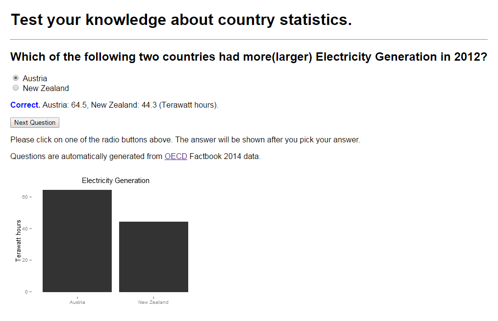
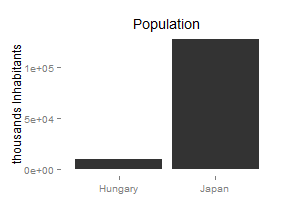

## How much do you know about the world?

</img>

---

## Application Overview

- Web application for learning country statistics
- Based on OECD 2014 Factbook data
- Simple question-and-answer interface
- Answers include plots that are easy to understand
- Questions are auto-generated from the data

</img>

---

## Implementation

1. Shiny server randomly picks a statistic (ex. population, GDP per capita) and picks two countries in the OECD Factbook data.

```
## [1] "Population"
```

```
## $country
## [1] "Hungary"
## 
## $value
## [1] 9920.361
```

```
## $country
## [1] "Japan"
## 
## $value
## [1] 127515
```

---

## Implementation

<ol start="2">
    <li>Questions and options are generated based on the data.</li>
    <li>Provide feedback by showing the values in a plot.</li>
</ol>

 

## Further Directions

- Include interactive plot for questions and answers 
- Include more data
- Include time-series related questions (ex. how GDP of a country changed over last 5 years)
